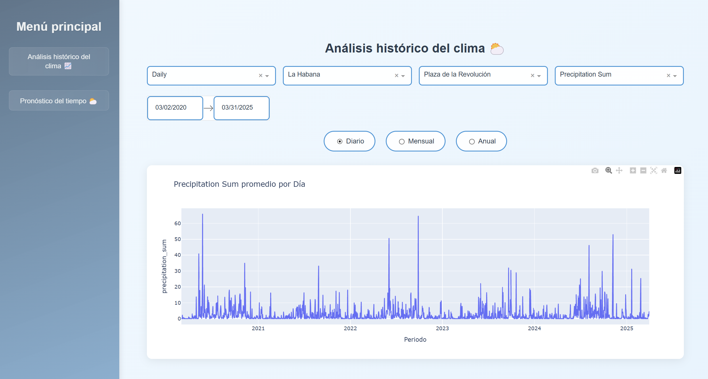

# Weather Dashboard ⛅

Este repositorio contiene un pipeline completo de ingeniería de datos, desde la ingesta hasta la visualización, con el objetivo de analizar los datos meteorológicos de Cuba tanto en tiempo real como históricamente. Además realiza pronósticos de clima para las próximas 24 horas.



## Pre-requisitos 📋

Para instalar las dependencias necesarias ejecute:

```
pip install -r requirements.txt
```

## Estructura del proyecto 🗂️

| Carpeta/Archivo       | Descripción                                              |
|-----------------------|----------------------------------------------------------|
| `src/data_ingestion`  | Contiene los scripts de ingesta de datos históricos y diarios |
| `src/storage`         | Maneja el almacenamiento de datos en MongoDB             |
| `src/transformation`  | Procesa y transforma los datos antes de su almacenamiento en la base de datos |
| `src/serving`         | Contiene la RestAPI para predecir el clima               |
| `pages/forecast`      | Layouts y callbacks de la página de pronósticos de la app |
| `pages/historical`    | Layouts y callbacks de la página de análisis históricos de la app |
| `assets/`            | Imágenes y estilos de la app                             |
| `Procfile`           | Configuración de despliegue en Render                    |
| `run_script.yml`     | Automatización de la extracción de datos climáticos de la API a diario |

## Despliegue 📦

La aplicación está disponible en el siguiente enlace: <https://meteorological-dashboard-hsr7.onrender.com>

## Herramientas y API utilizadas 🛠️

* [OpenWeatherMap](https://openweathermap.org/) - API de datos climáticos históricos
* [WeatherMap](https://www.weatherapi.com/) - API de datos climáticos en tiempo real
* [MongoDB](https://www.mongodb.com/) - Para almacenar los datos climáticos
* [FastAPI](https://fastapi.tiangolo.com/) - Para RestAPI
* [Render](https://render.com/) - Para despliegue de la app y el modelo de predicción.
* [Dash Plotly](https://dash.plotly.com/) - Para crear la interfaz de usuario
